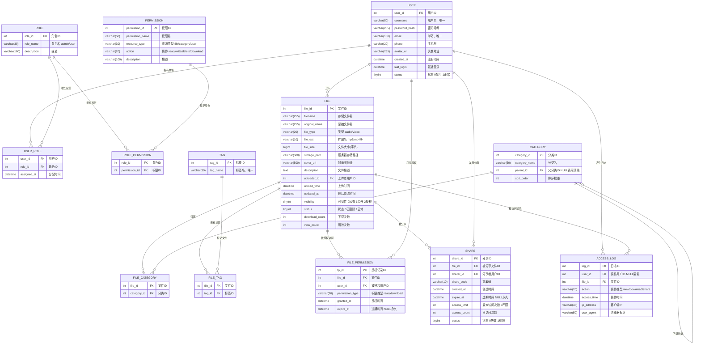

# 音像云数据库系统 — 需求分析说明与 ER 图

---

## 一、项目背景与概述

随着数字媒体的普及，个人和企业对音频、视频文件的存储与共享需求日益增长。本项目设计并实现一个**基于 B/S 架构的音像文件云存储管理系统**，支持多账户登录、文件上传/下载/预览、分类管理、标签检索、权限控制及访问审计等核心功能。

- **架构**：B/S（浏览器/服务器）
- **前端**：HTML + CSS + JavaScript（单页应用）
- **后端**：Python（Flask 框架）+ RESTful API
- **数据库**：MySQL，模式满足第三范式（3NF）
- **存储**：服务器本地存储（可扩展为对象存储）

---

## 二、功能需求分析

### 2.1 用户账户模块

| 编号 | 功能 | 说明 |
|------|------|------|
| F1-1 | 用户注册 | 填写用户名、密码、邮箱完成注册 |
| F1-2 | 用户登录 | 账号密码登录，支持记住登录状态（JWT Token） |
| F1-3 | 用户注销 | 清除 Token，退出登录 |
| F1-4 | 个人资料管理 | 修改头像、昵称、邮箱、手机号 |
| F1-5 | 密码修改 | 旧密码验证后更新密码 |
| F1-6 | 角色区分 | 系统内置管理员（admin）和普通用户（user）两种角色 |

### 2.2 文件管理模块

| 编号 | 功能 | 说明 |
|------|------|------|
| F2-1 | 文件上传 | 支持音频（mp3/wav/flac）及视频（mp4/avi/mkv）格式上传 |
| F2-2 | 文件下载 | 有权限的用户可下载文件，记录下载日志 |
| F2-3 | 文件预览 | 浏览器内在线播放音视频 |
| F2-4 | 文件删除 | 上传者或管理员可删除文件（逻辑删除） |
| F2-5 | 文件信息编辑 | 修改文件名称、描述、封面图 |
| F2-6 | 文件搜索 | 按文件名、标签、分类、上传者检索 |
| F2-7 | 文件排序 | 按上传时间、下载量、文件大小排序 |

### 2.3 分类与标签模块

| 编号 | 功能 | 说明 |
|------|------|------|
| F3-1 | 分类管理 | 支持多级分类（如：音乐 > 流行 > 国语），管理员维护 |
| F3-2 | 标签管理 | 用户为文件添加自定义标签 |
| F3-3 | 按分类浏览 | 前端以树状结构展示分类并过滤文件列表 |
| F3-4 | 按标签检索 | 点击标签聚合查看同标签文件 |

### 2.4 访问权限控制模块

| 编号 | 功能 | 说明 |
|------|------|------|
| F4-1 | 文件可见性 | 文件状态分为：公开 / 私有 / 指定用户可见 |
| F4-2 | 用户级授权 | 文件上传者可授予特定用户读/下载权限 |
| F4-3 | 角色级权限 | 不同角色拥有不同操作权限（增删改查） |
| F4-4 | 权限时效 | 授权可设置有效期，过期自动失效 |

### 2.5 文件分享模块

| 编号 | 功能 | 说明 |
|------|------|------|
| F5-1 | 生成分享链接 | 上传者生成含提取码的分享链接 |
| F5-2 | 分享有效期 | 可设置分享链接的过期时间 |
| F5-3 | 访问次数限制 | 可限制分享链接的最大访问次数 |
| F5-4 | 取消分享 | 上传者可手动使分享链接失效 |

### 2.6 审计日志模块

| 编号 | 功能 | 说明 |
|------|------|------|
| F6-1 | 访问记录 | 记录每次文件预览、下载、分享等操作 |
| F6-2 | 日志查询 | 管理员可按用户、文件、时间段查询日志 |
| F6-3 | 个人历史 | 普通用户可查看自己的操作历史 |

---

## 三、非功能需求

| 类别 | 要求 |
|------|------|
| 安全性 | 密码使用 bcrypt 哈希存储；JWT 鉴权；防止 SQL 注入（ORM 参数化查询） |
| 性能 | 文件列表查询响应时间 < 500ms；支持分页加载 |
| 可用性 | 前端兼容主流浏览器（Chrome/Firefox/Edge） |
| 可扩展性 | 数据库设计预留扩展字段；存储层可替换为 OSS |
| 数据完整性 | 外键约束、唯一约束、非空约束在数据库层面强制执行 |

---

## 四、系统架构设计

```
┌─────────────────────────────────────────────┐
│              浏览器（前端）                   │
│  HTML/CSS/JS  ←→  Fetch API / Axios          │
└────────────────────┬────────────────────────┘
                     │ HTTP/HTTPS (RESTful)
┌────────────────────▼────────────────────────┐
│              Python Flask 后端               │
│  路由层 → 业务逻辑层 → 数据访问层（SQLAlchemy）│
│  JWT 鉴权中间件 | 文件存储服务               │
└────────────────────┬────────────────────────┘
                     │ SQL
┌────────────────────▼────────────────────────┐
│              MySQL 数据库                    │
│  用户/角色/权限 | 文件元数据 | 分类/标签      │
│  分享记录 | 访问日志                         │
└─────────────────────────────────────────────┘
```

---

## 五、数据库实体关系图（ER 图）



---

## 六、实体与属性说明

### 6.1 USER（用户表）
存储系统所有注册用户信息。`password_hash` 使用 bcrypt 存储，明文密码不入库。`status` 用于封禁账户而不物理删除。

### 6.2 ROLE（角色表）
系统预设两类角色：
- `admin`：管理员，可管理所有用户、文件、分类
- `user`：普通用户，只能管理自己上传的文件

### 6.3 USER_ROLE（用户角色关联表）
多对多关联，记录每个用户被分配的角色及分配时间，支持一人多角色场景。

### 6.4 PERMISSION（权限表）
细粒度权限定义，以 **资源类型 + 操作** 组合描述，例如：
- `file` + `read`：查看文件列表及详情
- `file` + `download`：下载文件
- `file` + `delete`：删除任意文件（管理员专属）
- `category` + `write`：新增/修改分类

### 6.5 ROLE_PERMISSION（角色权限关联表）
将权限批量赋予角色，避免逐用户配置。

### 6.6 FILE（文件元数据表）
仅存储文件的**元信息**，文件实体存储于服务器磁盘（`storage_path` 指向物理路径）。`visibility` 字段区分文件来源与可访问范围，是实现**账户登录模式区分文件**的核心字段。

### 6.7 CATEGORY（分类表）
自引用结构（`parent_id` 指向同表 `category_id`），支持无限层级分类树。顶级分类的 `parent_id` 为 NULL。

### 6.8 FILE_CATEGORY（文件-分类关联表）
多对多关联，允许一个文件同时属于多个分类（如一首歌同时属于"流行"和"影视原声"）。

### 6.9 TAG（标签表）
标签名全局唯一，用户输入标签时若已存在则复用，保证数据一致性。

### 6.10 FILE_TAG（文件-标签关联表）
多对多关联，记录文件与标签的绑定关系。

### 6.11 FILE_PERMISSION（文件授权表）
实现细粒度的文件级访问控制：上传者可将私有文件授权给特定用户，指定权限类型（仅浏览 or 可下载）及有效期。

### 6.12 SHARE（分享记录表）
生成带提取码的分享链接，支持设置过期时间与访问次数上限，`status=0` 表示手动吊销。

### 6.13 ACCESS_LOG（访问日志表）
只追加不修改，记录所有对文件的操作行为，为审计与统计提供数据支撑。`user_id` 允许 NULL 以支持匿名分享链接访问的记录。

---

## 七、3NF 验证说明

**第一范式（1NF）**：所有表的每个字段均为原子值，无重复组，无嵌套集合。✓

**第二范式（2NF）**：所有非主键属性完全依赖于主键。
- 复合主键的关联表（`USER_ROLE`、`ROLE_PERMISSION`、`FILE_CATEGORY`、`FILE_TAG`）中，非主键属性（如 `assigned_at`）仅依赖完整复合键，不存在部分依赖。✓

**第三范式（3NF）**：不存在非主键属性对主键的传递依赖。
- `FILE` 表中，`uploader_id` → 用户信息（用户名、邮箱等）已拆分到独立的 `USER` 表，文件表不冗余存储用户属性。✓
- `CATEGORY` 表中，分类名称直接依赖 `category_id`，父分类信息通过外键关联而非内嵌字段。✓
- `SHARE` 表中，分享者信息通过 `sharer_id` 外键关联 `USER` 表，不在 `SHARE` 表冗余存储用户名等属性。✓

所有表均满足 3NF。

---

## 八、关键业务流程说明

### 8.1 文件上传流程
1. 用户登录（获取 JWT Token）
2. 前端携带 Token 调用上传接口，POST 文件及元信息
3. 后端验证 Token → 检查用户上传权限 → 保存文件到磁盘
4. 在 `FILE` 表插入元数据记录（`uploader_id` = 当前用户）
5. 处理分类、标签关联，写入 `FILE_CATEGORY`、`FILE_TAG`
6. 写入 `ACCESS_LOG`（action = 'upload'）

### 8.2 文件访问权限判断流程
```
请求访问文件
    ↓
文件 visibility = 公开？→ 是 → 允许访问
    ↓ 否
用户已登录？→ 否 → 拒绝（返回401）
    ↓ 是
用户是文件上传者？→ 是 → 允许访问
    ↓ 否
用户角色为 admin？→ 是 → 允许访问
    ↓ 否
FILE_PERMISSION 中存在有效授权？→ 是 → 按授权类型允许
    ↓ 否
拒绝访问（返回403）
```

### 8.3 分享链接访问流程
1. 用户访问分享链接，携带 `share_code`
2. 查询 `SHARE` 表，验证：链接有效（`status=1`）、未过期、访问次数未超限
3. 验证通过后 `access_count + 1`
4. 提供文件预览/下载，写入 `ACCESS_LOG`

---

## 九、数据库表清单汇总

| 表名 | 中文名 | 主键 | 说明 |
|------|--------|------|------|
| `user` | 用户表 | `user_id` | 系统账户信息 |
| `role` | 角色表 | `role_id` | 角色定义 |
| `user_role` | 用户角色表 | (`user_id`, `role_id`) | 用户与角色多对多 |
| `permission` | 权限表 | `permission_id` | 细粒度权限定义 |
| `role_permission` | 角色权限表 | (`role_id`, `permission_id`) | 角色与权限多对多 |
| `file` | 文件表 | `file_id` | 音像文件元数据 |
| `category` | 分类表 | `category_id` | 多级分类（自引用） |
| `file_category` | 文件分类表 | (`file_id`, `category_id`) | 文件与分类多对多 |
| `tag` | 标签表 | `tag_id` | 全局标签 |
| `file_tag` | 文件标签表 | (`file_id`, `tag_id`) | 文件与标签多对多 |
| `file_permission` | 文件授权表 | `fp_id` | 文件级用户授权 |
| `share` | 分享记录表 | `share_id` | 分享链接管理 |
| `access_log` | 访问日志表 | `log_id` | 操作审计记录 |

共 **13 张表**，全部满足第三范式（3NF）。
