# 音像云数据库系统实验报告  

池墨 PB23111703  

---

## 一、前期设计

### 1.1 项目背景与概述

随着数字媒体的普及，个人和企业对音频、视频文件的存储与共享需求日益增长。本项目设计并实现一个**基于 B/S 架构的音像文件云存储管理系统**，支持多账户登录、文件上传/下载/预览、分类管理、标签检索、权限控制及访问审计等核心功能。

- **架构**：B/S  
- **前端**：HTML + CSS + JavaScript
- **后端**：Python（Flask 框架）+ RESTful API
- **数据库**：MySQL，模式满足3NF
- **存储**：服务器本地存储（可扩展为对象存储）

### 1.2 功能需求分析

#### 1.2.1 用户账户模块

| 编号 | 功能 | 说明 |
|------|------|------|
| F1-1 | 用户注册 | 填写用户名、密码、邮箱完成注册 |
| F1-2 | 用户登录 | 账号密码登录，支持记住登录状态（JWT Token） |
| F1-3 | 用户注销 | 清除 Token，退出登录 |
| F1-4 | 个人资料管理 | 修改头像、昵称、邮箱、手机号 |
| F1-5 | 密码修改 | 旧密码验证后更新密码 |
| F1-6 | 角色区分 | 系统内置管理员（admin）和普通用户（user）两种角色 |

#### 1.2.2 文件管理模块

| 编号 | 功能 | 说明 |
|------|------|------|
| F2-1 | 文件上传 | 支持音频（mp3/wav/flac）及视频（mp4/avi/mkv）格式上传 |
| F2-2 | 文件下载 | 有权限的用户可下载文件，记录下载日志 |
| F2-3 | 文件预览 | 浏览器内在线播放音视频 |
| F2-4 | 文件删除 | 上传者或管理员可删除文件（逻辑删除） |
| F2-5 | 文件信息编辑 | 修改文件名称、描述、封面图 |
| F2-6 | 文件搜索 | 按文件名/描述、标签、分类检索（管理员端支持按文件名检索全库） |
| F2-7 | 文件排序 | 按上传时间、下载量、文件大小排序 |

#### 1.2.3 分类与标签模块

| 编号 | 功能 | 说明 |
|------|------|------|
| F3-1 | 分类管理 | 支持多级分类（如：音乐 > 流行 > 国语），管理员维护 |
| F3-2 | 标签管理 | 用户为文件添加自定义标签 |
| F3-3 | 按分类浏览 | 前端以树状结构展示分类并过滤文件列表 |
| F3-4 | 按标签检索 | 点击标签聚合查看同标签文件 |

#### 1.2.4 访问权限控制模块

| 编号 | 功能 | 说明 |
|------|------|------|
| F4-1 | 文件可见性 | 文件状态分为：公开 / 私有 / 指定用户可见 |
| F4-2 | 用户级授权 | 文件上传者可授予特定用户读/下载权限 |
| F4-3 | 角色级权限 | 不同角色拥有不同操作权限（增删改查） |
| F4-4 | 权限时效 | 授权可设置有效期，过期自动失效 |

#### 1.2.5 文件分享模块

| 编号 | 功能 | 说明 |
|------|------|------|
| F5-1 | 生成分享链接 | 上传者生成含提取码的分享链接 |
| F5-2 | 分享有效期 | 可设置分享链接的过期时间 |
| F5-3 | 访问次数限制 | 可限制分享链接的最大访问次数 |
| F5-4 | 取消分享 | 上传者可手动使分享链接失效 |

#### 1.2.6 审计日志模块

| 编号 | 功能 | 说明 |
|------|------|------|
| F6-1 | 访问记录 | 记录每次文件预览、下载、分享等操作 |
| F6-2 | 日志查询 | 管理员可按用户、文件、操作类型查询日志（分页） |
| F6-3 | 个人历史 | 普通用户可查看自己的操作历史 |

#### 1.2.7 接口调试模块（前端辅助）

| 编号 | 功能 | 说明 |
|------|------|------|
| F7-1 | API 可视化调试 | 网页内可发起 GET/POST/PUT/PATCH/DELETE 请求 |
| F7-2 | Token 自动携带 | 勾选后自动附带登录态 Bearer Token |
| F7-3 | 响应展示 | 显示状态码、响应头、响应体，便于联调与演示 |

### 1.3 非功能需求

| 类别 | 要求 |
|------|------|
| 安全性 | 密码使用 bcrypt 哈希存储；JWT 鉴权；防止 SQL 注入（ORM 参数化查询） |
| 性能 | 文件列表查询响应时间 < 500ms；支持分页加载 |
| 可用性 | 前端兼容主流浏览器（Chrome/Firefox/Edge） |
| 可扩展性 | 数据库设计预留扩展字段；存储层可替换为 OSS |
| 数据完整性 | 外键约束、唯一约束、非空约束在数据库层面强制执行 |

### 1.4 系统架构设计

```
┌─────────────────────────────────────────────┐
│              浏览器（前端）                   │
│  HTML/CSS/JS  ←→  Fetch API / Axios          │
└────────────────────┬────────────────────────┘
                     │ HTTP/HTTPS (RESTful)
┌────────────────────▼────────────────────────┐
│              Python Flask 后端               │
│  路由层 → 业务逻辑层 → 数据访问层（SQLAlchemy）│
│  JWT 鉴权中间件 | 文件存储服务               │
└────────────────────┬────────────────────────┘
                     │ SQL
┌────────────────────▼────────────────────────┐
│              MySQL 数据库                    │
│  用户/角色/权限 | 文件元数据 | 分类/标签      │
│  分享记录 | 访问日志                         │
└─────────────────────────────────────────────┘
```

### 1.5 ER 图

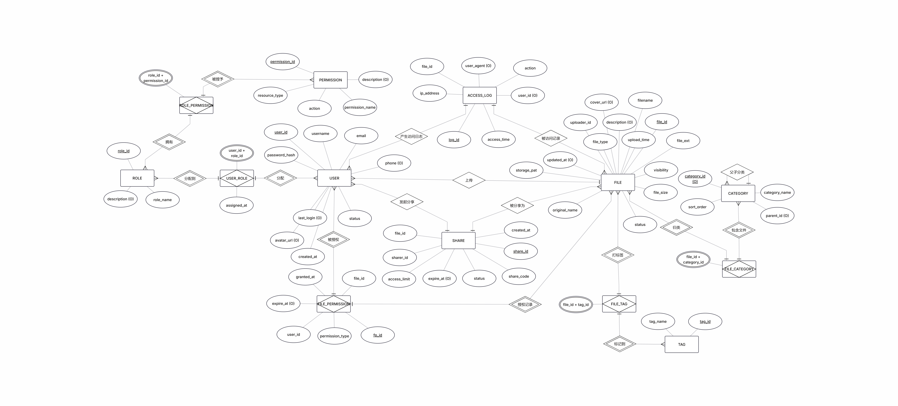
  
PS：`ACCESS_LOG.user_id` 允许为空（匿名分享访问），因此业务语义上是“日志可选关联用户”。

### 1.6 实体与属性说明

#### 1.6.1 USER（用户表）
存储系统所有注册用户信息。`password_hash` 使用 bcrypt 存储，明文密码不入库。`status` 用于封禁账户而不物理删除。

#### 1.6.2 ROLE（角色表）
系统预设两类角色：
- `admin`：管理员，可管理所有用户、文件、分类
- `user`：普通用户，只能管理自己上传的文件

#### 1.6.3 USER_ROLE（用户角色关联表）
多对多关联，记录每个用户被分配的角色及分配时间，支持一人多角色场景。

#### 1.6.4 PERMISSION（权限表）
细粒度权限定义，以 **资源类型 + 操作** 组合描述，例如：
- `file` + `read`：查看文件列表及详情
- `file` + `download`：下载文件
- `file` + `delete`：删除任意文件（管理员专属）
- `category` + `write`：新增/修改分类

#### 1.6.5 ROLE_PERMISSION（角色权限关联表）
将权限批量赋予角色，避免逐用户配置。

#### 1.6.6 FILE（文件元数据表）
仅存储文件的**元信息**，文件实体存储于服务器磁盘（`storage_path` 指向物理路径）。`visibility` 字段区分文件来源与可访问范围，是实现**账户登录模式区分文件**的核心字段。

#### 1.6.7 CATEGORY（分类表）
自引用结构（`parent_id` 指向同表 `category_id`），支持无限层级分类树。顶级分类的 `parent_id` 为 NULL。

#### 1.6.8 FILE_CATEGORY（文件-分类关联表）
多对多关联，允许一个文件同时属于多个分类（如一首歌同时属于"流行"和"影视原声"）。

#### 1.6.9 TAG（标签表）
标签名全局唯一，用户输入标签时若已存在则复用，保证数据一致性。

#### 1.6.10 FILE_TAG（文件-标签关联表）
多对多关联，记录文件与标签的绑定关系。

#### 1.6.11 FILE_PERMISSION（文件授权表）
实现细粒度的文件级访问控制：上传者可将私有文件授权给特定用户，指定权限类型（仅浏览 or 可下载）及有效期。

#### 1.6.12 SHARE（分享记录表）
生成带提取码的分享链接，支持设置过期时间与访问次数上限，`status=0` 表示手动吊销。

#### 1.6.13 ACCESS_LOG（访问日志表）
只追加不修改，记录所有对文件的操作行为，为审计与统计提供数据支撑。`user_id` 允许 NULL 以支持匿名分享链接访问的记录。

### 1.7 3NF 验证说明

**1NF**：所有表的每个字段均为原子值，无重复组，无嵌套集合。

**2NF**：所有非主键属性完全依赖于主键。
- 复合主键的关联表（`USER_ROLE`、`ROLE_PERMISSION`、`FILE_CATEGORY`、`FILE_TAG`）中，非主键属性（如 `assigned_at`）仅依赖完整复合键，不存在部分依赖。

**3NF**：不存在非主键属性对主键的传递依赖。
- `FILE` 表中，`uploader_id` → 用户信息（用户名、邮箱等）已拆分到独立的 `USER` 表，文件表不冗余存储用户属性。
- `CATEGORY` 表中，分类名称直接依赖 `category_id`，父分类信息通过外键关联而非内嵌字段。
- `SHARE` 表中，分享者信息通过 `sharer_id` 外键关联 `USER` 表，不在 `SHARE` 表冗余存储用户名等属性。

所有表均满足 3NF。

### 1.8 关键业务流程说明

#### 1.8.1 文件上传流程
1. 用户登录（获取 JWT Token）
2. 前端携带 Token 调用上传接口，POST 文件及元信息
3. 后端验证 Token → 检查用户上传权限 → 保存文件到磁盘
4. 在 `FILE` 表插入元数据记录（`uploader_id` = 当前用户）
5. 处理分类、标签关联，写入 `FILE_CATEGORY`、`FILE_TAG`
6. 写入 `ACCESS_LOG`（action = 'upload'）

#### 1.8.2 文件访问权限判断流程
```
请求访问文件
    ↓
文件 visibility = 公开？→ 是 → 允许访问
    ↓ 否
用户已登录？→ 否 → 拒绝（返回401）
    ↓ 是
用户是文件上传者？→ 是 → 允许访问
    ↓ 否
用户角色为 admin？→ 是 → 允许访问
    ↓ 否
FILE_PERMISSION 中存在有效授权？→ 是 → 按授权类型允许
    ↓ 否
拒绝访问（返回403）
```

#### 1.8.3 分享链接访问流程
1. 用户访问分享链接，携带 `share_code`
2. 查询 `SHARE` 表，验证：链接有效（`status=1`）、未过期、访问次数未超限
3. 验证通过后 `access_count + 1`
4. 提供文件预览/下载，写入 `ACCESS_LOG`

### 1.9 数据库表清单汇总

| 表名 | 中文名 | 主键 | 说明 |
|------|--------|------|------|
| `user` | 用户表 | `user_id` | 系统账户信息 |
| `role` | 角色表 | `role_id` | 角色定义 |
| `user_role` | 用户角色表 | (`user_id`, `role_id`) | 用户与角色多对多 |
| `permission` | 权限表 | `permission_id` | 细粒度权限定义 |
| `role_permission` | 角色权限表 | (`role_id`, `permission_id`) | 角色与权限多对多 |
| `file` | 文件表 | `file_id` | 音像文件元数据 |
| `category` | 分类表 | `category_id` | 多级分类（自引用） |
| `file_category` | 文件分类表 | (`file_id`, `category_id`) | 文件与分类多对多 |
| `tag` | 标签表 | `tag_id` | 全局标签 |
| `file_tag` | 文件标签表 | (`file_id`, `tag_id`) | 文件与标签多对多 |
| `file_permission` | 文件授权表 | `fp_id` | 文件级用户授权 |
| `share` | 分享记录表 | `share_id` | 分享链接管理 |
| `access_log` | 操作审计记录 | `log_id` | 操作审计记录 |

共 13 张表。

---

## 二、实现说明

### 2.1 框架结构

1. 前端
- 技术：HTML + CSS + JavaScript（单页应用）
- 入口：frontend/index.html
- 主要模块：frontend/js/app.js、auth.js、files.js、admin.js、api_tester.js

2. 后端
- 技术：Flask + SQLAlchemy + Flask-JWT-Extended
- 入口：backend/app.py
- 路由：backend/routes/*.py
- 模型：backend/models.py

3. 数据层
- MySQL
- 初始化脚本：sql/init.sql
- 一键初始化：backend/init_db.py

### 2.2 核心代码解析

#### 2.2.1 认证与账户体系

对应源码目录：
- backend/routes/auth.py

具体实现函数：
- register：注册用户并默认赋予 user 角色。
- login：校验 bcrypt 密码后签发 JWT。
- get_profile、update_profile：个人资料查询与更新。
- change_password：旧密码校验通过后写入新密码哈希。
- forgot_password、reset_password：重置凭证生成与验证。
- upload_avatar、get_avatar：头像上传与静态访问。
- _generate_reset_token、_verify_reset_token：重置 token 的签发与校验。

关键代码设计点：
- 登录 token 使用字符串 identity（create_access_token(identity=str(user.user_id))），规避部分 JWT 版本对 sub 类型的兼容问题。
- 密码全流程使用 bcrypt 哈希与比对，不在数据库保存明文。
- 重置密码 token 绑定用户 id 与密码哈希片段，密码一旦变化旧 token 自动失效。
- forgot-password 接口在用户不存在时返回统一提示，降低账号枚举风险。
- 头像上传限制扩展名并使用 secure_filename + 随机文件名，避免路径注入和重名覆盖。

#### 2.2.2 文件上传与分类策略

对应源码目录：
- backend/routes/files.py
- frontend/js/files.js

具体实现函数：
- 后端 upload_file、update_file：上传与元数据更新。
- 后端 _apply_base_media_category：自动补充一级分类（音频/视频）。
- 后端 _get_allowed_child_category_ids：限定可选二级分类范围。
- 后端 public_overview_stats：首页统计接口。
- 前端 detectMediaTypeByName、renderUploadCategoryOptionsByType：根据文件类型渲染子分类。
- 前端 submitUpload：组装 FormData 并做前置校验。

关键代码设计点：
- 分类策略采用“自动一级 + 手动二级”，减少用户误选并保证分类结构统一。
- 后端以 _get_allowed_child_category_ids 做二次校验，防止前端被绕过后写入非法分类。
- 上传失败时执行事务回滚并删除已落盘文件，避免数据库与磁盘状态不一致。
- 标签采用“存在即复用，不存在则创建”的方式，减少冗余标签记录。
- 前端在 submitUpload 中拦截“标签名与已选子分类重名”的输入，降低语义重复。

#### 2.2.3 可见性与授权

对应源码目录：
- backend/routes/files.py
- frontend/js/files.js

具体实现函数：
- 后端 get_file、download_file、stream_file：访问、下载、播放时统一走权限判断。
- 后端 get_file_permissions、add_file_permission：查看与新增文件授权。
- 后端 remove_file_permission：删除文件授权。
- 前端 openPermissionModal、savePermissionFromModal、removePermissionFromModal：授权弹窗增删改交互。

关键代码设计点：
- 文件访问控制统一依赖 check_file_access，避免不同接口权限口径不一致。
- 授权管理接口仅文件上传者或管理员可操作，防止越权修改授权名单。
- 授权类型限定为 read/download，并支持 expire_at 过期时间，便于精细化控制。
- 下载与播放在权限通过后再更新计数并记录日志，保证统计口径可信。

#### 2.2.4 分享码机制

对应源码目录：
- backend/routes/shares.py
- frontend/js/files.js

具体实现函数：
- 后端 create_share：创建分享记录。
- 后端 access_by_code：按分享码访问文件信息。
- 后端 revoke_share：吊销分享。
- 后端 _generate_code：生成唯一 share_code。
- 后端 _parse_expire_at：解析并兼容多种时间字符串。
- 前端 copyShareCode、fallbackCopyText：分享码复制与降级兼容。

关键代码设计点：
- 分享码唯一性由 _generate_code + 数据库查询冲突检查保障。
- create_share 只允许文件所有者或管理员创建分享，防止任意用户外链他人资源。
- _parse_expire_at 兼容 datetime-local、ISO8601、末尾 Z 等格式，降低前后端时间格式不一致导致的失败。
- access_by_code 在校验有效后执行 access_count 自增并写入 share_access 日志，实现可审计性。
- 前端复制逻辑采用 Clipboard API 优先、fallback 兜底，提升浏览器兼容性。

#### 2.2.5 管理后台与接口调试

对应源码目录：
- backend/routes/admin.py
- backend/routes/files.py
- frontend/js/auth.js
- frontend/js/app.js
- frontend/js/api_tester.js

具体实现函数：
- 后端 dashboard_stats、list_users、toggle_user_status、set_user_role、create_user、list_all_files（均在 require_admin 保护下）。
- 后端 public_overview_stats：首页统计接口。
- 前端 updateNavByUser：按 admin 角色显示管理与 API 调试入口。
- 前端 showPage：对 admin、apitest 页面做路由级拦截。
- 前端 apiTesterAllowed、apiSendRequest、initApiTester：接口调试权限与请求执行。

关键代码设计点：
- 管理能力采用“后端 require_admin + 前端导航隐藏 + 页面路由拦截”三层控制。
- apiSendRequest 再次校验 apiTesterAllowed，防止直接调用函数绕过页面入口限制。
- dashboard_stats 聚合用户数、文件数、分享数、日志数、总容量，便于后台总览。
- public_overview_stats 将 private_file_count 定义为 visibility in (0, 2)，与当前业务规则保持一致。

### 2.3 仓库目录

```text
db_lab2
|-- backend
|   |-- app.py
|   |-- config.py
|   |-- extensions.py
|   |-- init_db.py
|   |-- models.py
|   |-- requirements.txt
|   |-- routes
|   |   |-- admin.py
|   |   |-- auth.py
|   |   |-- categories.py
|   |   |-- files.py
|   |   |-- logs.py
|   |   |-- shares.py
|   |   |-- tags.py
|   |   \-- __init__.py
|   |-- utils
|   |   |-- auth_helper.py
|   |   |-- file_helper.py
|   |   \-- __init__.py
|-- deploy
|   |-- env
|   |   \-- backend.env.example
|   |-- nginx
|   |   \-- mediacloud.conf
|   \-- systemd
|       \-- mediacloud.service
|-- frontend
|   |-- index.html
|   |-- css
|   |   \-- style.css
|   \-- js
|       |-- admin.js
|       |-- api.js
|       |-- api_tester.js
|       |-- app.js
|       |-- auth.js
|       \-- files.js
|-- sql
|   \-- init.sql
|-- README.md
```

---

## 三、结果展示

### 3.1 首页与导航截图
- 登录前：
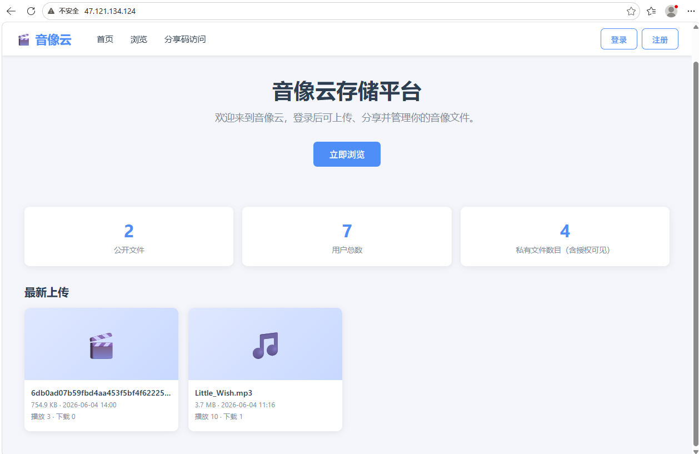

- 登录后：
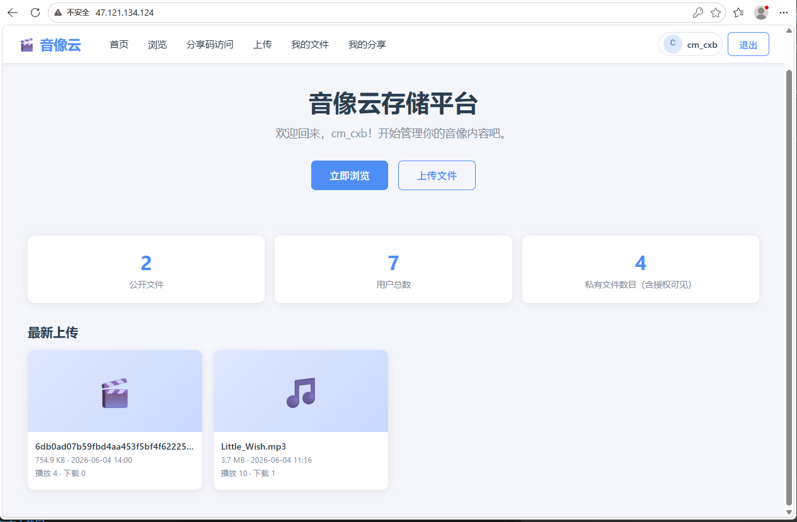

PS：管理员账户登录后导航栏会多出“管理后台”和“接口调试”入口。

### 3.2 上传与分类截图

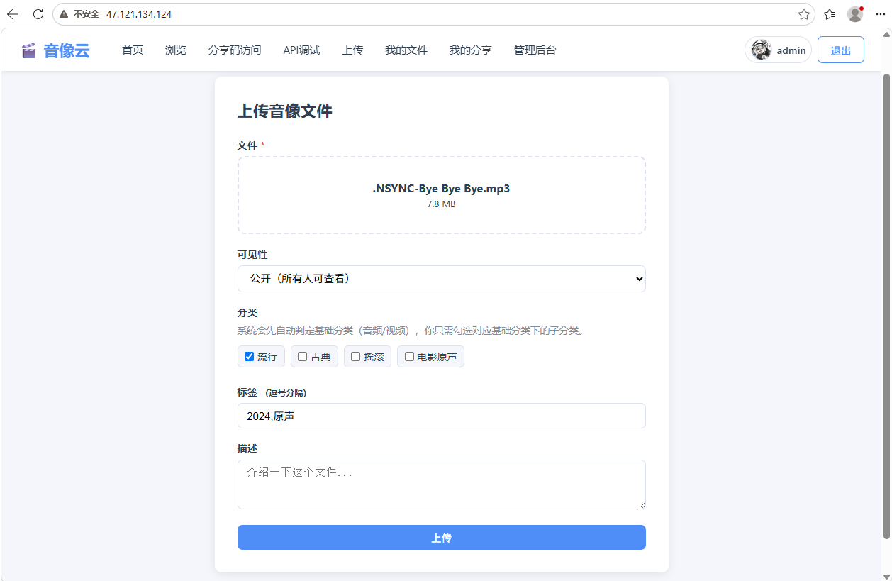

### 3.3 文件详情与授权管理截图

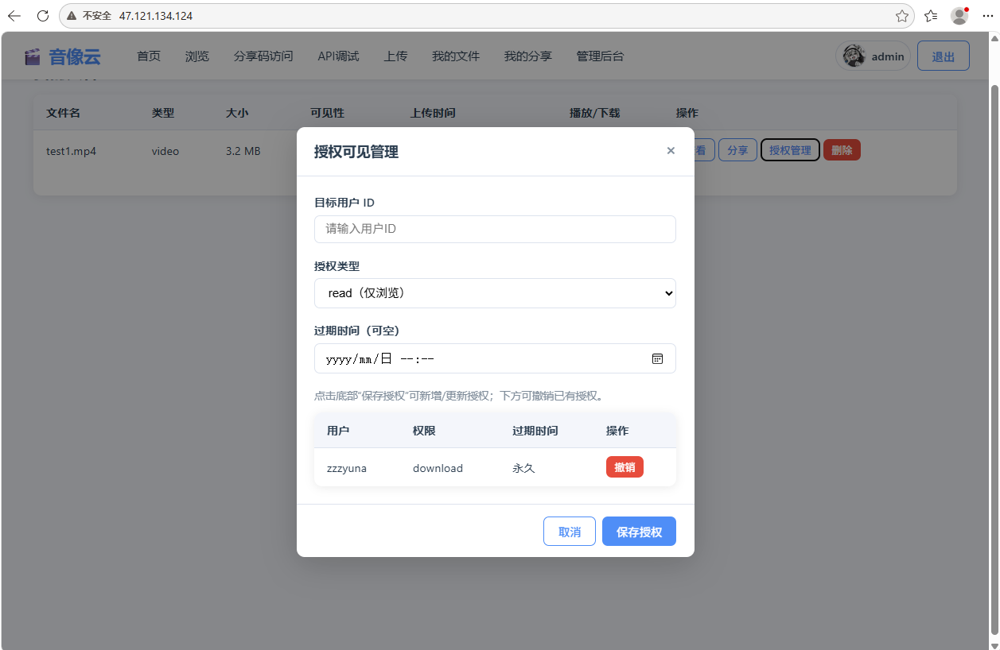

### 3.4 分享功能截图
- 我的分享列表页：
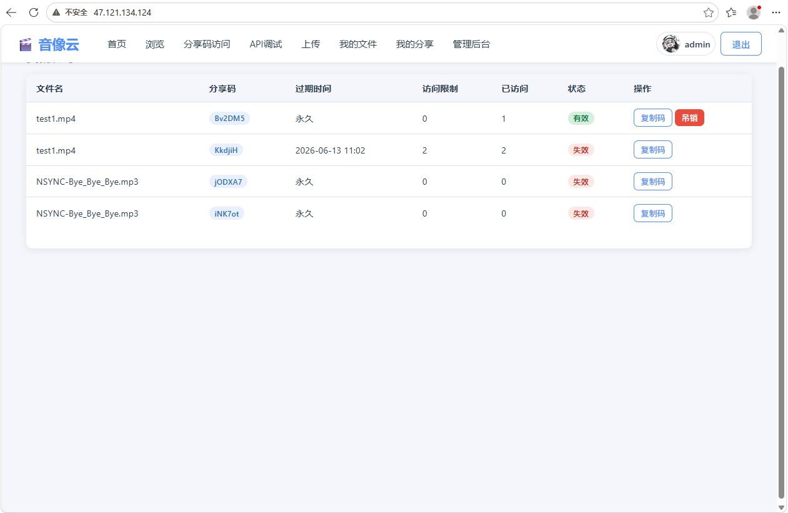

- 分享码访问页：
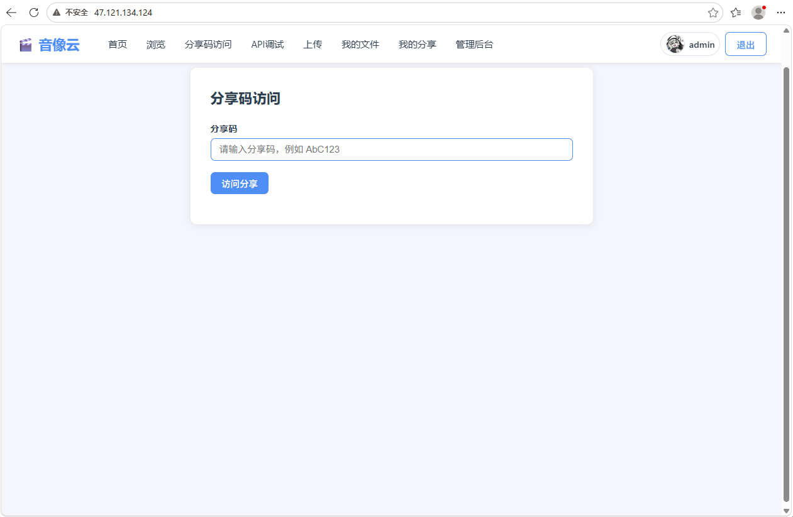

### 3.5 账户与安全截图
- 账户中心：
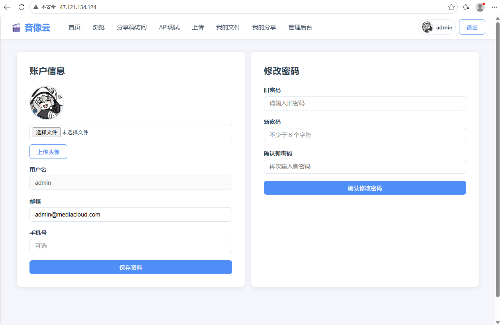

- 找回/重置密码：
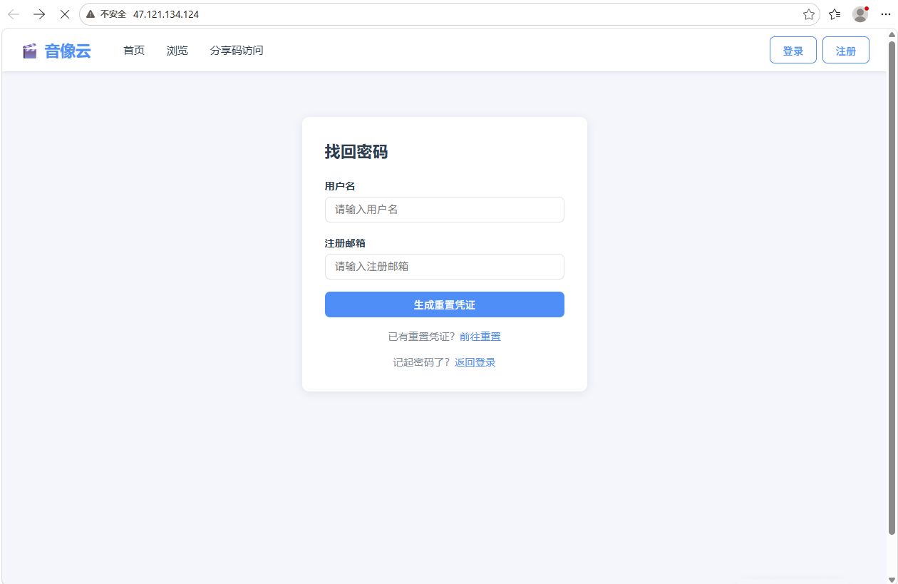
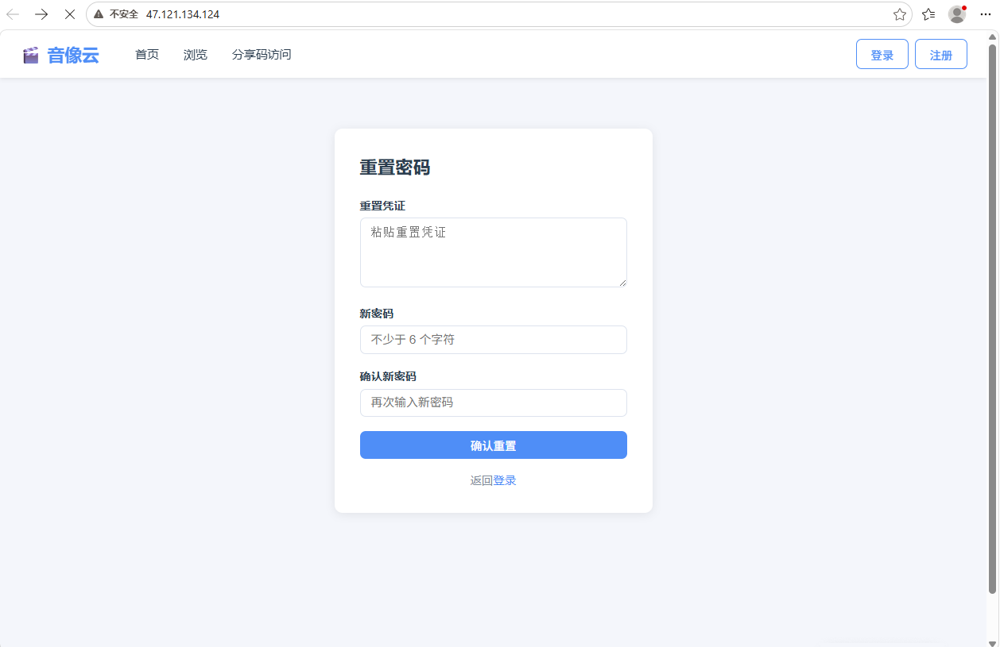

### 3.6 管理后台截图
- 管理后台页：
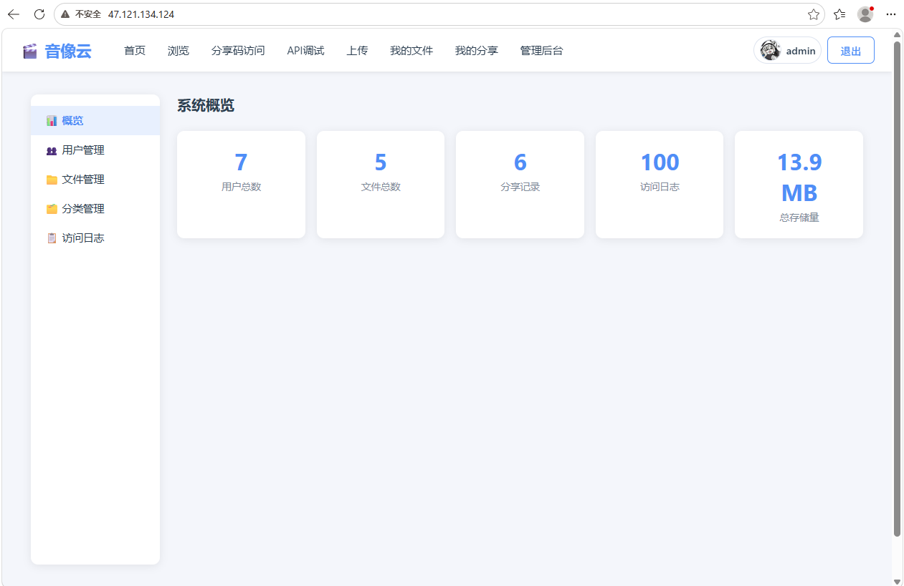

- 分类管理：
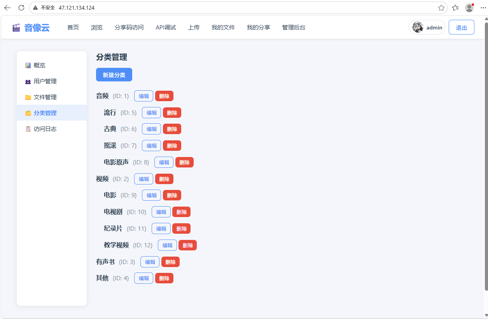

- 日志查询页：
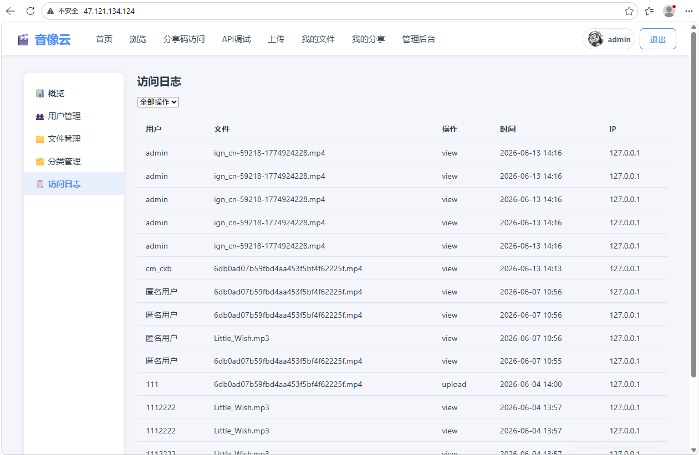
---

## 四、实验总结与改进方向

### 4.1 实验总结

本实验完成了从需求分析、ER 设计到系统实现与部署的完整闭环，实现了音视频文件管理系统的核心能力，包括账户鉴权、文件上传播放下载、分类标签检索、授权可见、分享码访问、操作日志审计和管理后台。

### 4.2 已实现的关键点

1. 权限链路完整：登录态、角色权限、文件级授权、分享访问均可控。
2. 数据模型稳定：13 张核心表支持当前业务并满足 3NF。
3. 前端交互完善：新增账户中心、分享码访问页、授权管理弹窗，系统可演示性良好。

### 4.3 未来改进方向

1. 找回密码升级为邮件验证码 + 一次性重置链接流程，并增加重置次数与频率限制。
2. 文件授权支持用户名模糊搜索、批量授权、授权复制（将一个文件的授权策略复制到多个文件）。
3. 增加“回收站”功能：文件删除后先进入回收站，支持恢复与定期清理，降低误删风险。
4. 增加“收藏/最近访问”功能，提升常用文件的二次访问效率。
5. 分享能力增强：支持分享链接密码、是否允许下载开关、按分享链接单独统计访问来源。
6. 分类与标签体验优化：支持批量打标签、标签合并、分类拖拽排序与一键迁移。
7. 检索功能增强：新增组合筛选（类型+标签+时间区间+上传者）和搜索历史推荐。
8. 播放体验增强：支持播放进度记忆、倍速播放、连续播放列表与字幕文件关联。
9. 管理后台新增可视化分析页：按日期统计上传量、活跃用户、热门文件、分享转化率。
10. 增加站内通知：授权变化、分享到期、文件被访问等事件实时提醒用户。
